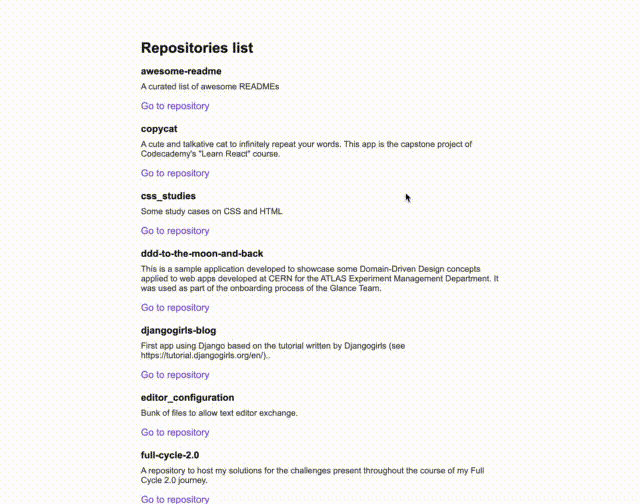

# 🧐 github-explorer
A quick overview of all my GitHub repositories at a Glance. This project was built as part of my studies on React, Typescript and Webpack.

## Available Scripts

In the project directory, you can run:

### `yarn dev`

Runs the app in the development mode.\
Open [http://localhost:8000](http://localhost:8000) to view it in the browser.
